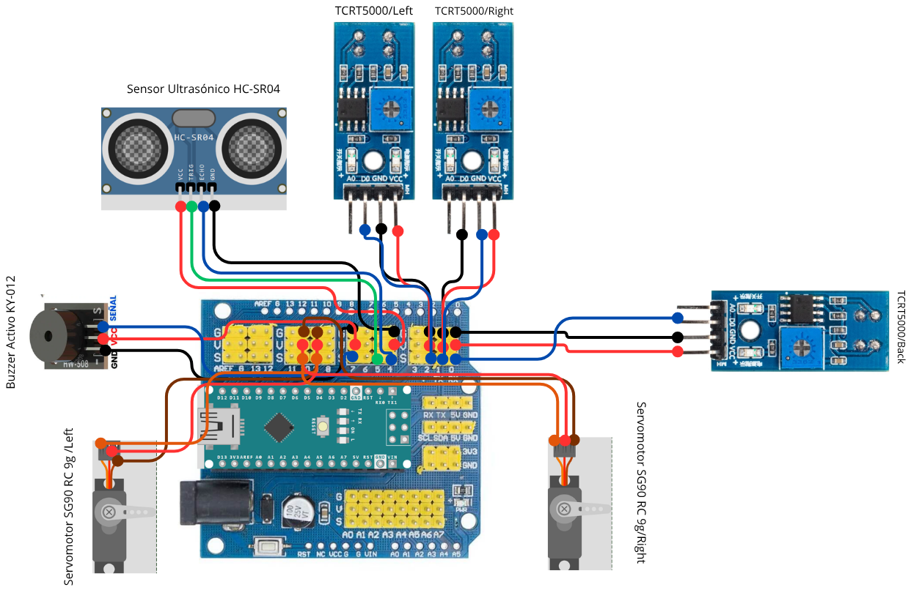

# Robot Minisumo

Proyecto academico de Robot Minisumo basado en Arduino Nano montado sobre Arduino Nano Expansion I/O Shield.



## Hardware Actual

| Componente | Cantidad | Funcion |
| --- | ---: | --- |
| Arduino Nano V3 | 1 | Control principal |
| Arduino Nano Expansion I/O Shield | 1 | Distribucion de pines, VCC y GND |
| HC-SR04 | 1 | Deteccion frontal de oponente |
| TCRT5000 | 3 | Deteccion de borde: Left, Right y Back |
| SG90 RC 9g | 2 | Traccion solo si son de rotacion continua |
| KY-012 | 1 | Indicador sonoro |
| Porta pilas AA y pilas AA | 1 set | Alimentacion mediante la Shield |

## Pinout Definitivo

Pinout real probado: Left D3, Right D2 y Back D0. D0 comparte RX Serial; si hay problemas de carga o monitor, desconectar temporalmente el TCRT Back.

| Componente | Pin del componente | Pin Arduino/Shield | Senal |
| --- | --- | --- | --- |
| TCRT5000 Left | DO | D3 | TCRT_LEFT |
| TCRT5000 Right | DO | D2 | TCRT_RIGHT |
| TCRT5000 Back | DO | D0 | TCRT_BACK |
| HC-SR04 | Trig | D4 | TRIG_HCSR04 |
| HC-SR04 | Echo | D5 | ECHO_HCSR04 |
| KY-012 | S | D7 | BUZZER_SIG |
| SG90 Left | Signal | D9 | SERVO_LEFT |
| SG90 Right | Signal | D10 | SERVO_RIGHT |

Todos los modulos deben compartir GND comun. La Shield organiza conectores, pero no aumenta la capacidad de corriente del Arduino.

## Compilar Firmware

```powershell
$Cli = 'A:\robot-minisumo\tools\arduino-cli\arduino-cli.exe'
$Config = 'A:\robot-minisumo\.arduino-cli\arduino-cli.yaml'
& $Cli --config-file $Config compile --fqbn arduino:avr:nano firmware\robot_minisumo_final
```

## KiCad

Abrir `hardware/kicad/robot_minisumo.kicad_pro`. El esquematico representa conexiones sobre la Shield; no se disena PCB personalizada.

## Herramienta Web

Abrir `web-control/index.html`. La herramienta es visual y de apoyo; Web Serial queda como mejora futura opcional.

## Pendientes Criticos

- PENDIENTE CRITICO: confirmar fisicamente si los SG90 son de rotacion continua.
- Si los SG90 son estandar de posicion, no sirven como traccion continua del robot minisumo sin modificacion.
- Verificar alimentacion de servos; si hay reinicios o movimientos erraticos, usar fuente externa de 5 V para servos con GND comun al Arduino.
- Ejecutar validacion fisica de sensores y calibrar `LINE_ACTIVE_LOW`.

