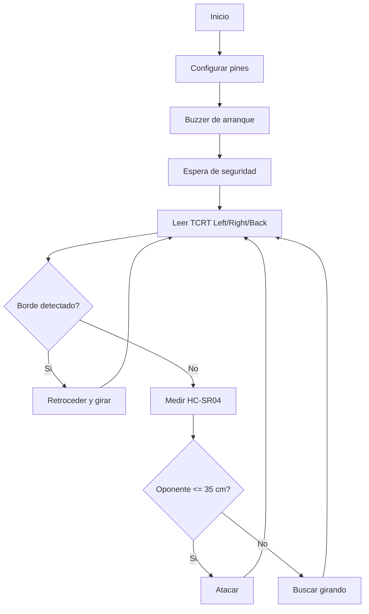
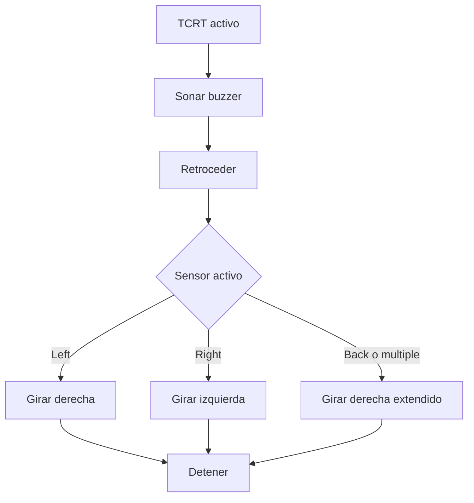
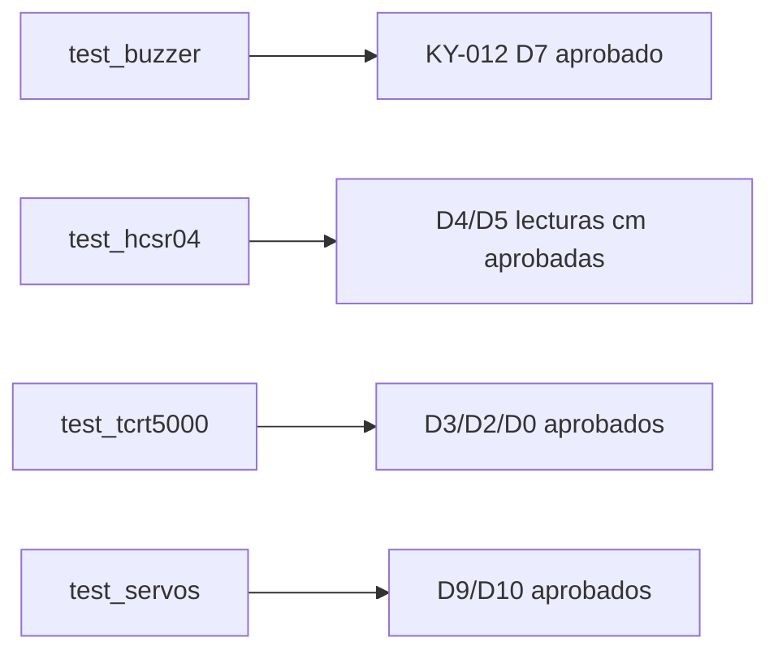

# Diagramas De Flujo

## Flujo general

```mermaid
flowchart TD
  A["Inicio"] --> B["Configurar pines"]
  B --> C["Buzzer de arranque"]
  C --> D["Espera de seguridad"]
  D --> E["Leer TCRT Left/Right/Back"]
  E --> F{"Borde detectado?"}
  F -- "Si" --> G["Retroceder y girar"]
  G --> E
  F -- "No" --> H["Medir HC-SR04"]
  H --> I{"Oponente <= 35 cm?"}
  I -- "Si" --> J["Atacar"]
  I -- "No" --> K["Buscar girando"]
  J --> E
  K --> E
```

## Evasion de borde

```mermaid
flowchart TD
  A["TCRT activo"] --> B["Sonar buzzer"]
  B --> C["Retroceder"]
  C --> D{"Sensor activo"}
  D -- "Left" --> E["Girar derecha"]
  D -- "Right" --> F["Girar izquierda"]
  D -- "Back o multiple" --> G["Girar derecha extendido"]
  E --> H["Detener"]
  F --> H
  G --> H
```

## Pruebas de hardware

```mermaid
flowchart LR
  A["test_buzzer"] --> B["KY-012 D7 aprobado"]
  C["test_hcsr04"] --> D["D4/D5 lecturas cm aprobadas"]
  E["test_tcrt5000"] --> F["D3/D2/D0 aprobados"]
  G["test_servos"] --> H["D9/D10 aprobados"]
```
