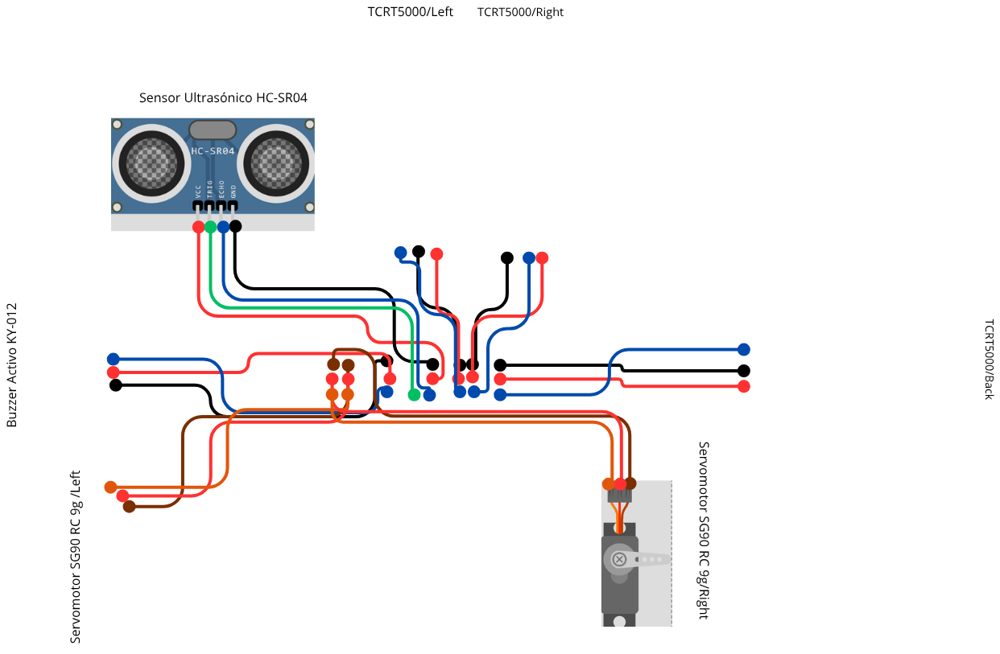

# Reporte Academico: Robot Minisumo

## 1. Portada

**Alumno:** Álvarez Villegas José Ángel  
**Materia:** MICROCONTROLADORES  
**Grupo:** 2809  
**Proyecto:** Robot Minisumo  
**Fecha:** 2026-06-05

## 2. Indice

1. Introduccion.
2. Objetivo general.
3. Objetivos especificos.
4. Investigacion documental.
5. Materiales y equipo.
6. Lista final de conexiones.
7. Diagrama final de conexiones.
8. Esquematicos del circuito.
9. Funcionamiento del sistema.
10. Codigo implementado.
11. Panel de monitoreo para demostracion.
12. Algoritmos.
13. Pseudocodigo.
14. Diagramas de flujo.
15. Simulacion y validacion.
16. Pruebas realizadas.
17. Resultados.
18. Conclusiones.
19. Referencias.
20. Anexos.

## 3. Introduccion

El Robot Minisumo es un sistema autonomo basado en Arduino Nano que usa sensores de linea para detectar el borde del area de competencia, un sensor ultrasonico HC-SR04 para localizar al oponente, servomotores SG90 para traccion diferencial y un buzzer KY-012 para senalizacion.

## 4. Objetivo general

Consolidar un prototipo funcional de Robot Minisumo con firmware, documentacion, esquematico KiCad, validacion y carpeta de entrega coherentes con las conexiones finales reales.

## 5. Objetivos especificos

- Documentar la BOM final.
- Documentar la lista final de conexiones.
- Implementar firmware modular para busqueda, ataque y evasion de borde.
- Validar sensores, servos y buzzer con pruebas individuales.
- Generar reporte academico y entregables finales.

## 6. Investigacion documental

El Arduino Nano se usa como controlador principal por su compatibilidad con el ecosistema Arduino y disponibilidad de entradas/salidas digitales. El HC-SR04 mide distancia por tiempo de vuelo ultrasonico. Los TCRT5000 integran emisor infrarrojo y fototransistor para detectar cambios de reflectancia. Los SG90 de rotacion continua permiten traccion simple mediante pulsos tipo servo, y el KY-012 entrega senal sonora con control digital.

## 7. Materiales y equipo

Ver `docs/bom_final.md` y `report/assets/bom_final.md`.

## 8. Lista final de conexiones

| Componente | Pin del componente | Pin Arduino/Shield | Senal |
| --- | --- | --- | --- |
| TCRT5000 Left | DO | D3 | TCRT_LEFT |
| TCRT5000 Right | DO | D2 | TCRT_RIGHT |
| TCRT5000 Back | DO | D0 | TCRT_BACK |
| HC-SR04 | Trig | D4 | TRIG_HCSR04 |
| HC-SR04 | Echo | D5 | ECHO_HCSR04 |
| KY-012 | S | D7 | BUZZER_SIG |
| SG90 Left | Signal | D9 | SERVO_LEFT |
| SG90 Right | Signal | D10 | SERVO_RIGHT |

Advertencia: D0 y D1 corresponden a RX/TX del Arduino Nano. El prototipo final usa D0 para `TCRT_BACK`, por lo que se debe desconectar temporalmente durante carga si interfiere.

## 9. Diagrama final de conexiones



Version PDF del diagrama final: `assets/diagrama_conexiones_final.pdf`.

## 10. Esquematicos del circuito

El proyecto KiCad esta en `hardware/kicad/robot_minisumo.kicad_pro`. El esquematico es documental y representa el montaje real sobre Shield, con GND comun, VCC_5V para sensores/buzzer y alimentacion estable para servos.

## 11. Funcionamiento del sistema

El robot da prioridad a la deteccion de borde. Si cualquier TCRT5000 detecta borde, retrocede y gira. Si no hay borde, mide distancia con HC-SR04. Si detecta un oponente a 35 cm o menos, avanza para atacar. Si no detecta oponente, busca girando.

## 12. Codigo implementado

```cpp
const byte PIN_TCRT_LEFT = 3;
const byte PIN_TCRT_RIGHT = 2;
const byte PIN_TCRT_BACK = 0;
const byte PIN_TRIG_HCSR04 = 4;
const byte PIN_ECHO_HCSR04 = 5;
const byte PIN_BUZZER = 7;
const byte PIN_SERVO_LEFT = 9;
const byte PIN_SERVO_RIGHT = 10;
```

Funciones principales: `configurarPines`, `leerUltrasonico`, `leerSensoresLinea`, `avanzar`, `retroceder`, `girarIzquierda`, `girarDerecha`, `detenerRobot`, `buscarOponente`, `atacar`, `evitarBorde`, `sonarBuzzer`, `pruebaSensores`, `pruebaUltrasonico`, `pruebaServos`, `procesarComandoPanel` y `publicarEstadoPanel`.

## 13. Panel de monitoreo para demostracion

Se agrego un panel web de monitoreo compacto en `web-control/` para apoyar la grabacion del robot funcionando. El objetivo del panel es mostrar en una sola pantalla de laptop lo importante de la operacion: proceso activo, sensores, actuadores, movimiento, pruebas rapidas y eventos recientes.

Componentes monitoreados:

- HC-SR04 ultrasonico.
- TCRT5000 Left, Right y Back.
- Servo/Motor izquierdo SG90.
- Servo/Motor derecho SG90.
- Buzzer KY-012.
- Movimiento resumido del robot.

Procesos mostrados:

- Inicializacion.
- Lectura de linea.
- Lectura ultrasonica.
- Buscar.
- Ataque.
- Evadir borde.
- Retroceso.
- Giro izquierdo.
- Giro derecho.
- Detenido.

El panel incluye modo demo / grabacion. En este modo los estados son simulados desde el panel y se indica claramente al usuario que no corresponden a lecturas reales del Arduino. Esto permite preparar tomas de video donde se expliquen casos como borde, ataque, busqueda, pruebas de sensores, pruebas de servos, buzzer y detencion.

Tambien se implemento integracion opcional con Web Serial API. Si el navegador soporta Web Serial, el boton `Conectar Arduino` permite seleccionar el puerto del Arduino a 9600 baudios. El firmware final publica mensajes como `STATE:BUSCAR`, `STATE:ATACAR`, `TCRT_LEFT:1`, `DIST_CM:20`, `MOTOR_LEFT:AVANZAR` y `BUZZER:ON`. El panel parsea esos mensajes y actualiza sensores, actuadores, procesos y registro compacto de eventos.

El panel tambien incluye botones de pruebas rapidas. Si existe conexion Web Serial, envia comandos como `CMD:TEST_SENSORES`, `CMD:TEST_SERVOS`, `CMD:TEST_BUZZER`, `CMD:TEST_ULTRASONICO`, `CMD:DEMO_BORDE`, `CMD:DEMO_ATAQUE`, `CMD:DEMO_BUSCAR` y `CMD:STOP`. Si no existe conexion, los botones activan modo demo y actualizan visualmente el tablero.

Descripcion visual del panel: en la parte superior se muestran conexion, firmware, distancia, accion y modo. La zona central contiene chips de procesos y tarjetas compactas para TCRT Left/Right/Back, HC-SR04, Servo Left, Servo Right, Buzzer y movimiento. Debajo se ubican los botones de pruebas rapidas y un log limitado a eventos recientes.

La utilidad principal durante la grabacion es que toda la informacion importante cabe en la vista de la laptop, sin depender de scroll, y permite explicar que sensor se activo, que actuador responde y que movimiento hace el robot.

## 14. Algoritmos

Ver `docs/algoritmos.md`.

## 15. Pseudocodigo

Ver `docs/pseudocodigo.md`.

## 16. Diagramas de flujo

Ver `docs/diagramas_flujo.md`.

## 17. Simulacion y validacion

Ver `simulation/casos_prueba.md`, `simulation/validacion_logica.md` y `validation/registro_pruebas.md`.

## 18. Pruebas realizadas

| Prueba | Resultado esperado | Resultado observado | Estado |
| --- | --- | --- | --- |
| Buzzer KY-012 | Sonido intermitente al ejecutar test_buzzer | Sonido confirmado por usuario | Aprobado |
| HC-SR04 | Lecturas de distancia en cm | Lecturas observadas: 151, 152, 46, 47, 4, 11, 16, 7 y 6 cm | Aprobado |
| TCRT5000 Left | Cambio digital al detectar linea/borde | Los tres sensores funcionan con tabla final: Left D3, Right D2, Back D0 | Aprobado |
| TCRT5000 Right | Cambio digital al detectar linea/borde | Los tres sensores funcionan con tabla final: Left D3, Right D2, Back D0 | Aprobado |
| TCRT5000 Back | Cambio digital al detectar linea/borde | Funciona en D0; advertencia por RX Serial documentada | Aprobado |
| Servo D9 aislado | Movimiento adelante y atras | 1700 us adelanta y 1300 us atrasa | Aprobado |
| Servos D9/D10 conjunto | D9 avanza y D10 acompana sin quedarse quieto | D9 avanza, D10 acompana invertido por montaje, ninguno se queda quieto | Aprobado |
| Firmware final | Arranque serial y logica cargada | Firmware final cargado en COM8 y arranque serial observado | Aprobado |
| Panel web compacto | Mostrar estado general, procesos, componentes, pruebas y eventos en una pantalla | Panel compacto actualizado con modo demo, pruebas rapidas y Web Serial opcional | Aprobado |
| Robot fisico | Prototipo opera con sensores y actuadores finales | Estado reportado por usuario: robot fisico funcional | Aprobado |

## 19. Resultados

El prototipo fisico quedo funcional. Se confirmaron buzzer, HC-SR04, tres TCRT5000 y servos SG90. El pinout final real quedo documentado y el firmware final se cargo en COM8.

La version funcional cargada fue confirmada por Serial Monitor:

```text
Robot Minisumo Final
1.0.0-funcional
FUNCIONAL_PROBADO
```

## 20. Conclusiones

El proyecto final integra hardware, firmware y documentacion de forma coherente con el robot funcional real. La principal restriccion tecnica es el uso de D0 para el sensor trasero, debido a que comparte RX Serial. La recomendacion es desconectar temporalmente ese sensor durante cargas de firmware o futuras depuraciones seriales.

## 21. Referencias

- Documentacion Arduino Nano.
- Hojas tecnicas HC-SR04, TCRT5000, SG90 y KY-012.
- Documentacion KiCad.
- BOM y lista final de conexiones anexadas al proyecto.

## 22. Anexos

- `firmware/`.
- `hardware/kicad/`.
- `docs/`.
- `simulation/`.
- `validation/`.
- `web-control/`.
