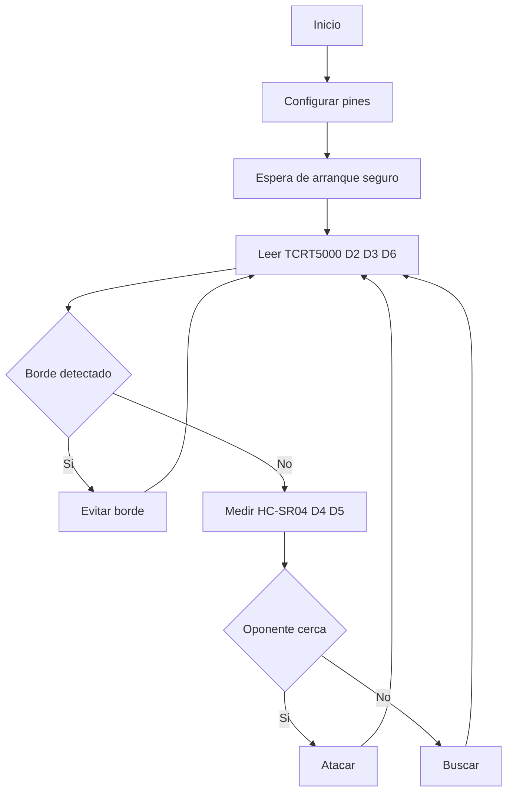
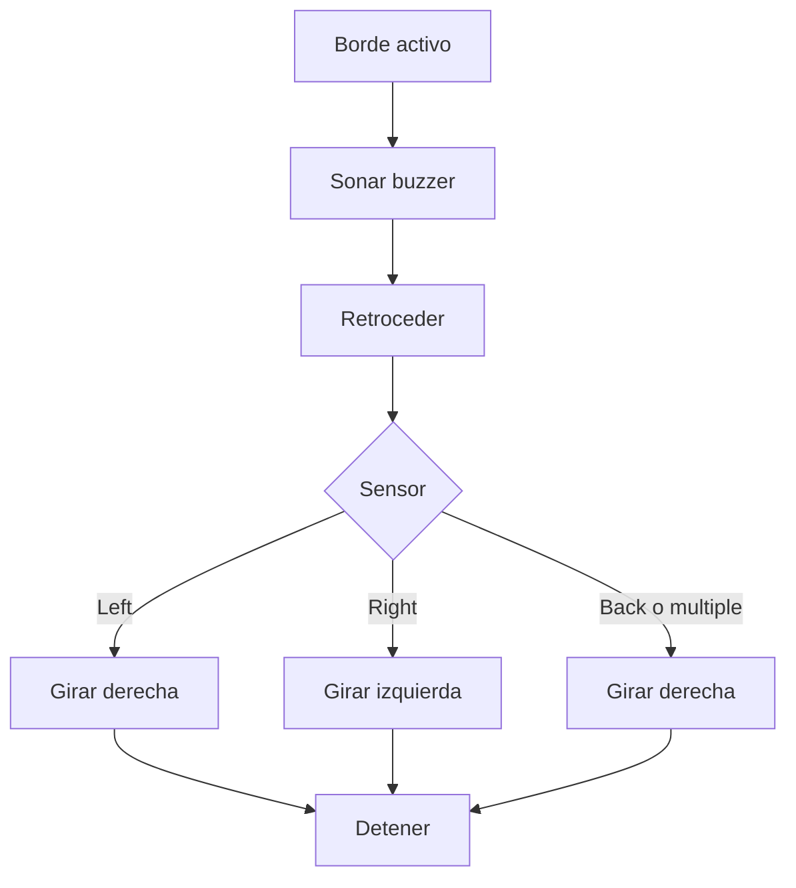
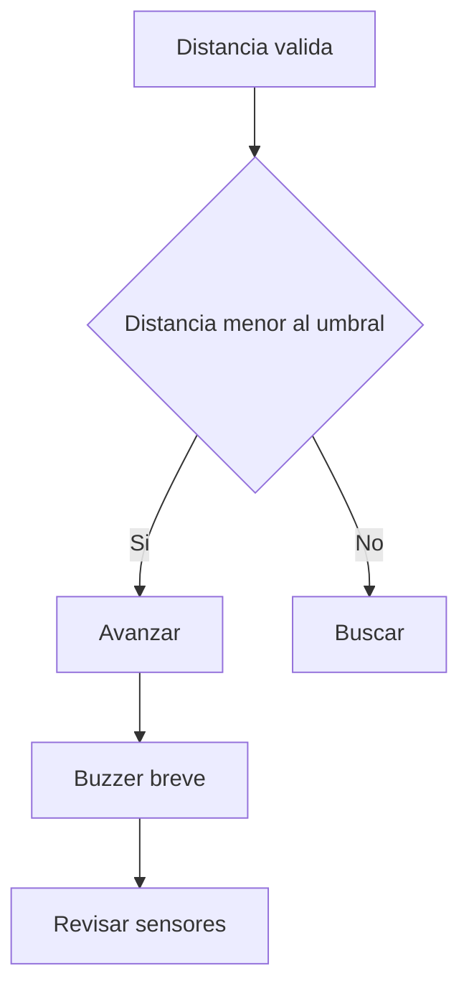
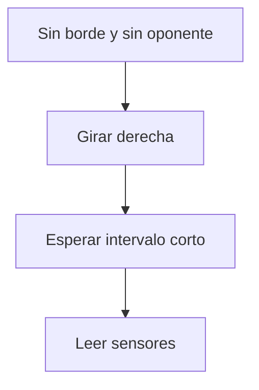
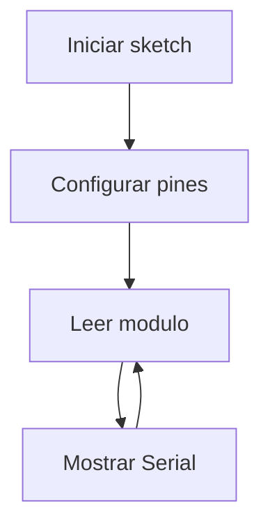
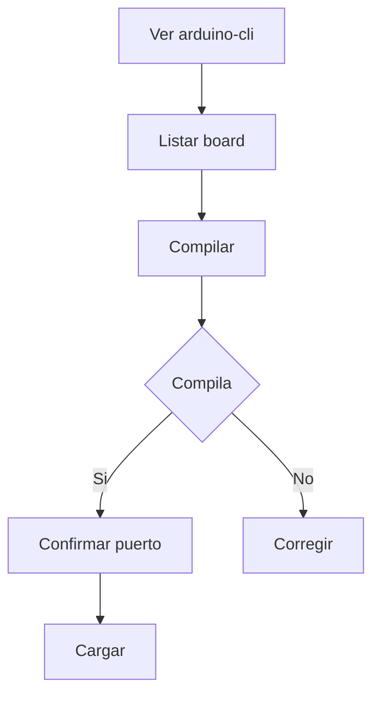
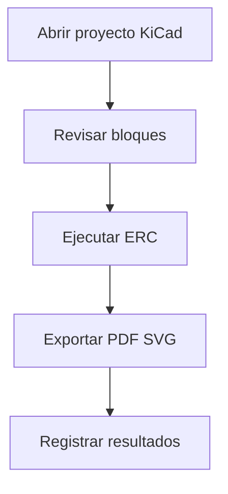

# Diagramas De Flujo

## Flujo General

```mermaid
flowchart TD
  A[Inicio] --> B[Configurar pines]
  B --> C[Espera de arranque seguro]
  C --> D[Leer TCRT5000 D2 D3 D6]
  D --> E{Borde detectado}
  E -- Si --> F[Evitar borde]
  F --> D
  E -- No --> G[Medir HC-SR04 D4 D5]
  G --> H{Oponente cerca}
  H -- Si --> I[Atacar]
  H -- No --> J[Buscar]
  I --> D
  J --> D
```

## Evasion De Borde

```mermaid
flowchart TD
  A[Borde activo] --> B[Sonar buzzer]
  B --> C[Retroceder]
  C --> D{Sensor}
  D -- Left --> E[Girar derecha]
  D -- Right --> F[Girar izquierda]
  D -- Back o multiple --> G[Girar derecha]
  E --> H[Detener]
  F --> H
  G --> H
```

## Ataque

```mermaid
flowchart TD
  A[Distancia valida] --> B{Distancia menor al umbral}
  B -- Si --> C[Avanzar]
  C --> D[Buzzer breve]
  D --> E[Revisar sensores]
  B -- No --> F[Buscar]
```

## Busqueda

```mermaid
flowchart TD
  A[Sin borde y sin oponente] --> B[Girar derecha]
  B --> C[Esperar intervalo corto]
  C --> D[Leer sensores]
```

## Pruebas De Sensores

```mermaid
flowchart TD
  A[Iniciar sketch] --> B[Configurar pines]
  B --> C[Leer modulo]
  C --> D[Mostrar Serial]
  D --> C
```

## Carga De Firmware

```mermaid
flowchart TD
  A[Ver arduino-cli] --> B[Listar board]
  B --> C[Compilar]
  C --> D{Compila}
  D -- Si --> E[Confirmar puerto]
  E --> F[Cargar]
  D -- No --> G[Corregir]
```

## Validacion KiCad

```mermaid
flowchart TD
  A[Abrir proyecto KiCad] --> B[Revisar bloques]
  B --> C[Ejecutar ERC]
  C --> D[Exportar PDF SVG]
  D --> E[Registrar resultados]
```
